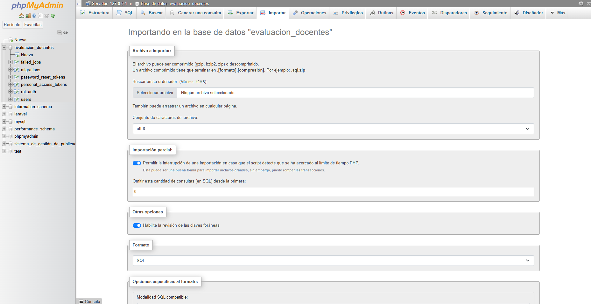

# 🎓 Proyecto Evaluación Docente

Este repositorio contiene la implementación **parcial** de una **aplicación web** para la evaluación del desempeño de los docentes en una institución educativa. El sistema está desarrollado con **Laravel** y **Blade** como motor de plantillas, utilizando **MySQL** como base de datos.

---

## 📑 Tabla de Contenidos

1. [📋 Descripción General](#descripción-general)
2. [⭐ Características Principales](#características-principales)
3. [🏗️ Estructura del Proyecto](#estructura-del-proyecto)
4. [📌 Requisitos](#requisitos)
5. [🚀 Instalación y Ejecución](#instalación-y-ejecución)
6. [📱 Uso de la Aplicación](#uso-de-la-aplicación)
7. [⚙️ Metodología de Desarrollo](#metodología-de-desarrollo)
8. [👨‍💻 Autores](#autores)
9. [📜 Licencia](#licencia)
10. [📬 Contacto](#contacto)

---

## 📋 Descripción General

El **Proyecto Evaluación Docente** optimiza el proceso de evaluación de los docentes a través de una plataforma que:

- 🔍 Permite a los **estudiantes** evaluar de forma anónima.
- 👨‍💼 Brinda a los **coordinadores/decanos** la posibilidad de ingresar evaluaciones administrativas.
- 🧑‍🏫 Facilita a los **docentes** la autoevaluación de su desempeño.
- 📊 Genera **reportes**, **estadísticas** y **actas de compromiso** para el seguimiento y mejora continua.
- ⚠️ Emite **alertas** y **notificaciones** ante bajo rendimiento.
- ⚖️ Gestiona **procesos de sanción o retiro** según sea necesario.

### 📚 Documentación detallada

- **Accede** a la documentación completa mediante el pdf **(⚠️ DESACTUALIZADO ⚠️)**:  
  [Proyecto_de_Evaluación_Docente.pdf](Documentacion/Proyecto_de_Evaluación_Docente.pdf)

- **Accede** a la plantilla de Desarrollo De Apliaciones web del proyecto:
  [Definición_del_Proyecto___Desarrollo_de_aplicaciones_web](Documentacion/Definición_del_Proyecto___Desarrollo_de_aplicaciones_web.pdf)

- **Accede** a la plantilla de Bases De Datos del proyecto:  
  [Plantilla_de_Definición_del_Proyecto\_\_\_Base_de_Datos_II.pdf](Documentacion/Plantilla_de_Definición_del_Proyecto___Base_de_Datos_II.pdf)

---

## ⭐ Características Principales

- 🔐 **Autenticación de usuarios** con múltiples roles (administrador, decano/coordinador, docente).
- 📊 **Dashboard personalizado** según el rol del usuario.
- 👨‍💼 **Panel de Administrador** con gestión de períodos de evaluación y roles.
- 🏛️ **Panel de Decano/Coordinador** con:
  - 📝 Generación y gestión de actas de compromiso
  - ⚠️ Alertas de bajo desempeño docente
  - 📈 Seguimiento a planes de mejora
  - ⚖️ Procesos de sanción y/o retiro
  - 📊 Estadísticas y reportes por facultad/programa
- 🧑‍🏫 **Panel de Docente** con:
  - 📋 Visualización de resultados de evaluación
  - 📊 Acceso a estadísticas personales
  - ⚙️ Configuración de datos personales
- ✅ **Sistema de evaluación** completo con múltiples dimensiones y criterios.
- 📈 **Reportes y gráficos estadísticos** en tiempo real.

---

## 🏗️ Estructura del Proyecto

El proyecto utiliza la estructura estándar de Laravel 10.x, optimizada para el sistema de evaluación docente:

```plaintext
Evaluacion_Docente/
├─ app/                      # Lógica principal de la aplicación
│  ├─ Console/               # Comandos Artisan personalizados
│  ├─ Exceptions/            # Manejadores de excepciones personalizados
│  ├─ Http/                  # Capa HTTP de la aplicación
│  │  ├─ Controllers/        # Controladores (Admin, Decano, Docente)
│  │  ├─ Middleware/         # Middleware personalizado
│  │  └─ Requests/           # Form Requests para validación
│  ├─ Models/                # Modelos Eloquent del sistema
│  │  ├─ ActaCompromiso.php  # Modelo para actas de compromiso
│  │  ├─ Coordinacion.php    # Modelo de coordinaciones
│  │  ├─ Docente.php         # Modelo de docentes
│  │  ├─ Estudiante.php      # Modelo de estudiantes
│  │  ├─ Facultad.php        # Modelo de facultades
│  │  ├─ ProcesoSancion.php  # Modelo para procesos disciplinarios
│  │  ├─ Programa.php        # Modelo de programas académicos
│  │  ├─ Rol.php             # Modelo de roles de usuario
│  │  ├─ User.php            # Modelo principal de usuarios
│  │  └─ Usuario.php         # Modelo extendido de usuarios
│  ├─ Providers/             # Service Providers de Laravel
│  └─ View/                  # Componentes de vista personalizados
│
├─ bootstrap/                # Archivos de arranque de Laravel
├─ config/                   # Archivos de configuración
├─ database/                 # Gestión de base de datos
│  ├─ factories/             # Factories para testing
│  ├─ migrations/            # Migraciones de base de datos
│  ├─ seeders/               # Seeders para datos iniciales
│  └─ sql/                   # Scripts SQL y procedimientos almacenados
│
├─ Documentacion/            # Documentación técnica del proyecto
│  ├─ Proyecto_de_Evaluación_Docente.pdf
│  ├─ Definición_del_Proyecto___Desarrollo_de_aplicaciones_web.pdf
│  └─ Plantilla_de_Definición_del_Proyecto___Base_de_Datos_II.pdf
│
├─ public/                   # Archivos públicos accesibles vía web
│  ├─ build/                 # Assets compilados por Vite
│  ├─ css/                   # Hojas de estilo personalizadas
│  ├─ fonts/                 # Fuentes tipográficas
│  ├─ images/                # Imágenes y recursos gráficos
│  ├─ js/                    # JavaScript personalizado
│  ├─ sass/                  # Archivos SASS/SCSS
│  └─ index.php              # Punto de entrada de la aplicación
│
├─ resources/                # Recursos de desarrollo
│  ├─ css/                   # Archivos CSS fuente
│  ├─ js/                    # Archivos JavaScript fuente
│  └─ views/                 # Plantillas Blade
│      ├─ Administrador/     # Vistas del panel administrativo
│      ├─ auth/              # Vistas de autenticación
│      ├─ components/        # Componentes Blade reutilizables
│      ├─ Decano/            # Vistas del panel de decano/coordinador
│      ├─ Docente/           # Vistas del panel docente
│      ├─ layouts/           # Layouts base de la aplicación
│      ├─ profile/           # Vistas de perfil de usuario
│      └─ *.blade.php        # Vistas generales (dashboard, importar, etc.)
│
├─ routes/                   # Definición de rutas
│  ├─ api.php                # Rutas de API REST
│  └─ web.php                # Rutas web principales
│
├─ storage/                  # Almacenamiento interno
│  ├─ app/                   # Archivos de aplicación
│  ├─ framework/             # Archivos del framework
│  └─ logs/                  # Logs del sistema
│
├─ tests/                    # Suite de pruebas automatizadas
├─ vendor/                   # Dependencias de Composer
├─ node_modules/             # Dependencias de Node.js
│
├─ .env                      # Variables de entorno (local)
├─ .env.example              # Plantilla de variables de entorno
├─ .gitignore                # Archivos ignorados por Git
├─ composer.json             # Dependencias y configuración de PHP
├─ package.json              # Dependencias y scripts de Node.js
├─ tailwind.config.js        # Configuración de Tailwind CSS
├─ vite.config.js            # Configuración de Vite (build tool)
└─ README.md                 # Documentación principal del proyecto
```

### 📁 Directorios Principales

- **app/Models/**: Contiene los modelos Eloquent que representan las entidades del sistema de evaluación docente
- **resources/views/**: Organizadas por roles (Administrador, Decano, Docente) para facilitar el mantenimiento
- **database/sql/**: Scripts SQL específicos y procedimientos almacenados para funcionalidades avanzadas
- **public/**: Assets públicos optimizados con Vite para mejor rendimiento
- **Documentacion/**: Documentación técnica y plantillas del proyecto académico

---

## 📌 Requisitos

### Para ejecutar el proyecto

- 🐘 **PHP 8.x** y **Composer** (para gestionar dependencias en Laravel).
- 🐬 **MySQL 5.7+** o **MariaDB** como sistema de gestión de base de datos.
- 🌐 **Servidor Web** (Apache o Nginx) configurado para ejecutar aplicaciones Laravel.
- 🟢 **Node.js** y **npm** para compilar assets (opcional, si se modifican los archivos JS/CSS).
- 🔄 **XAMPP**, **WAMP** o similar si se desea un entorno de desarrollo local integrado.

---

## 🚀 Instalación y Ejecución

### Requisitos previos

- 🐘 **PHP 8.1** o superior (requerido por el proyecto)
- 🐬 **MySQL 5.7+** o **MariaDB**
- 🔄 **Composer** (versión 2.x recomendada)
- 🟢 **Node.js** (16.x o superior) y **npm**
- 🌐 **Servidor web** (Apache/Nginx) o **XAMPP/WAMP/MAMP**

### Configuración del entorno local

1. **Clonar el repositorio** 📥:
   ```bash
   git clone https://github.com/SLarkZ01/Evaluacion_Docente.git
   cd Evaluacion_Docente
   ```

2. **Instalar dependencias de PHP** 📦:
   ```bash
   composer install
   ```

3. **Instalar dependencias de JavaScript** 📦:
   ```bash
   npm install
   ```

4. **Configurar archivo .env** ⚙️:
   ```bash
   cp .env.example .env
   php artisan key:generate
   ```

5. **Configurar base de datos** 🗄️:
   - Crear una base de datos MySQL llamada `evaluacion_docentes`
   - Editar el archivo `.env` con tus credenciales de base de datos:
     ```
      DB_CONNECTION=mysql
      DB_HOST=127.0.0.1
      DB_PORT=3306
      DB_DATABASE=evaluacion_docentes
      DB_USERNAME=root
      DB_PASSWORD=
     ```

6. **Correr las migraciones y seeders de Laravel**💾:
   ```bash
   php artisan migrate
   php artisan migrate:fresh --seed
   ```

7. **Instalar la base de datos** 🗄️:

   - Ahora en phpMyAdmin importar la base de datos que se encuentra [aqui](database/sql/evaluacion_docentes.sql)

   

8. **Compilar los estilos para tailwind css** 🎨:
   ```bash
   npm run dev
   ```

9. **Ejecutar el servidor de desarrollo** (tambien puedes ingresar por **XAMPP**)🖥️:
    ```bash
    php artisan serve
    ```

10. **Acceder a la aplicación** 🌐:
    - Abrir el navegador y visitar: `http://127.0.0.1:8000`
    - o si tienes **XAMPP** ve a la ruta: `http://localhost/Evaluacion_Docente/public/`

---

## 📱 Uso de la Aplicación

### Roles y Accesos

- 👨‍💼 **Administrador**:
  - Acceso a través de `/Admin`
  - Gestión de períodos de evaluación
  - Administración de roles y permisos
  - Generación de reportes globales

- 🏛️ **Decano/Coordinador**:
  - Acceso a través de `/decano`
  - Gestión de actas de compromiso
  - Monitoreo de alertas de bajo desempeño
  - Seguimiento a planes de mejora
  - Gestión de procesos de sanción o retiro

- 🧑‍🏫 **Docente**:
  - Acceso a través de `/docente`
  - Consulta de resultados de evaluación
  - Visualización de estadísticas personales
  - Configuración de datos personales

### Funcionalidades Principales

- 📝 **Actas de Compromiso**:
  - Creación y gestión de actas para docentes con bajo rendimiento
  - Seguimiento de compromisos y planes de mejora

- ⚠️ **Alertas de Bajo Desempeño**:
  - Notificación automática de docentes con calificaciones por debajo del umbral
  - Dashboard visual con indicadores de rendimiento

- ⚖️ **Procesos de Sanción**:
  - Gestión de procesos disciplinarios
  - Seguimiento a través de diferentes estados

- 📊 **Reportes y Estadísticas**:
  - Visualización de promedios por facultad y programa
  - Gráficos interactivos de rendimiento docente
  - Identificación de docentes destacados

---

## ⚙️ Metodología de Desarrollo

El proyecto se desarrolla siguiendo una metodología ágil (Scrum), que incluye:

- 📅 **Planificación de sprints**: Definición y priorización de funcionalidades.
- 🗣️ **Reuniones de seguimiento**: Para coordinar avances y detectar impedimentos.
- 🔍 **Revisión y retrospectiva**: Evaluación del progreso y ajuste del plan de trabajo.
- 🔄 **Control de versiones**: Gestión del código fuente mediante Git.

---

## 👨‍💻 Autores

- 🎨 **Thomas Montoya Magon** – Frontend y vistas Blade
- 🖌️ **Juan Daniel Bravo** – Frontend y UI/UX
- 💻 **Alejandro Martínez Salazar** – Backend Laravel
- 🗄️ **Daniel Rivas Agredo** – Base de Datos y procedimientos almacenados
- 🔧 **Luisa Julieth Joaqui** – Backend y APIs

---

## 📜 Licencia

Este proyecto se encuentra bajo la licencia MIT. Ver el archivo `LICENSE` para más detalles.

---

## 📬 Contacto

Para preguntas, sugerencias o reportar errores, puedes crear un issue en el repositorio o contactar directamente a alguno de los autores.

---

¡Gracias por tu interés en el **Proyecto Evaluación Docente**! 🌟 Juntos estamos contribuyendo a mejorar la calidad educativa a través de un sistema de evaluación transparente, robusto y eficaz.
